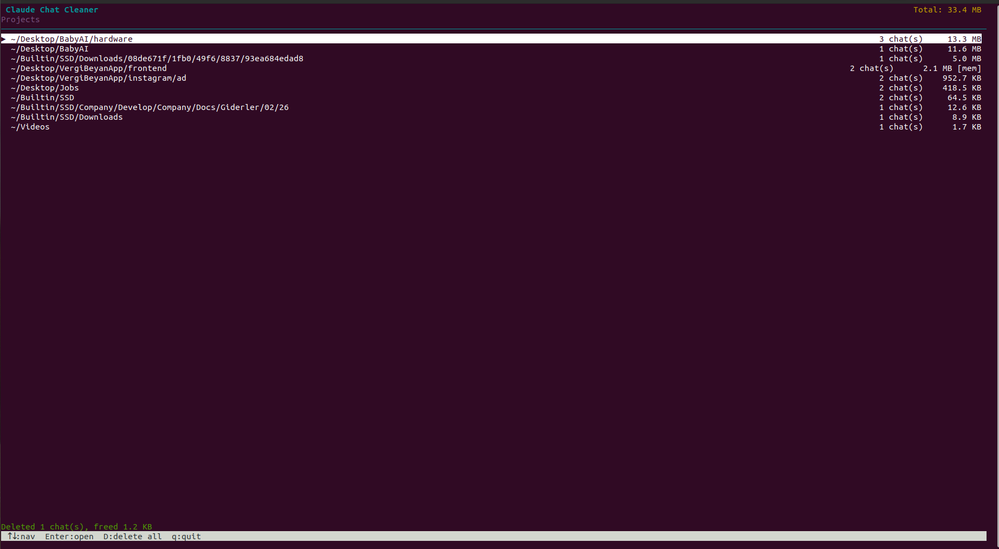
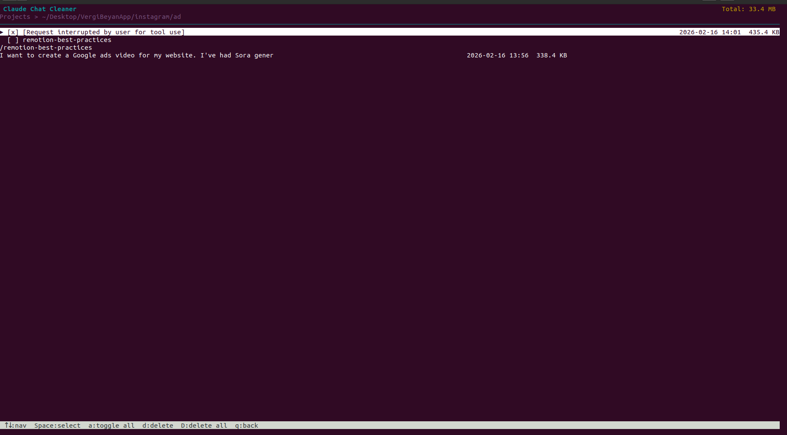

# Claude Chat Cleaner

Terminal UI for browsing and deleting [Claude Code](https://docs.anthropic.com/en/docs/claude-code) conversation history.

Claude Code stores every conversation as JSONL files under `~/.claude/projects/`. Over time these accumulate and eat disk space. This tool lets you browse, inspect, and bulk-delete them from a simple curses interface.

## Screenshots

### Project list



### Chat list



## Requirements

- Python 3.8+
- No external dependencies (uses only the standard library)

## Usage

```bash
python3 claude_chat_cleaner.py
```

## Keybindings

### Project list

| Key              | Action                        |
|------------------|-------------------------------|
| `↑`/`↓` or `j`/`k` | Navigate                  |
| `Enter` or `→`  | Open project                  |
| `D`              | Delete all chats in project   |
| `q`              | Quit                          |

### Chat list

| Key              | Action                        |
|------------------|-------------------------------|
| `↑`/`↓` or `j`/`k` | Navigate                  |
| `Space`          | Toggle selection              |
| `a`              | Select / deselect all         |
| `d`              | Delete selected (or current)  |
| `D`              | Delete all chats in project   |
| `q` or `←`      | Back to project list          |

All deletions require confirmation before proceeding.

## What gets deleted

Each conversation consists of a `.jsonl` file and an optional companion directory (same name, no extension). Both are removed on deletion. The tool never touches `memory/` directories or `CLAUDE.md` files.
